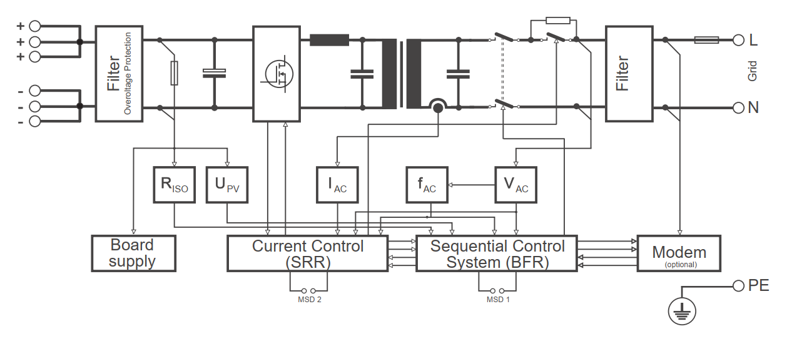

# SMA-SB2500-Off-Grid
The grid tie solar inverter SMA Sunny Boy SB2500 is a beautifully designed transformer isolated grid tie inverter. It is probably possible to convert it to an off grid batter inverter by reprogramming or redesigning the logic  board

Checkout my [hackaday.io](https://hackaday.io/project/183357-grid-tie-inverter-sma-sunny-boy-sb2500-openlogic) page for pictures of the inside of the inverter and a project log.

The block diagram from the SB2500 manual.

The inverter has an H-bridge with 4 IGBTs (SKW30NF60) driven by IR2113S mosfet drivers. These drive an 2mH inductor + 4.7uF capacitor step down converter and then a isolation transformer 153V primary/230V secondary 9.6A. On the grid side are three safety relais, EMC filtering and a measurement transformer for the logic board the measure the grid voltages.
All the logic is powered from the DC side, several voltages are generated using a switching power converter which generates all the drive voltages for the IGBT drivers and the logi board.
The logic board contains an SAFC808 microcontroller, probably with an interchangable AT70C020, 2 MBit memory chip, for grid monitoring and sequencing. A DSP56F803 from Freescale provides the switching waveforms. 

The layout is drawn in Kicad. 

Exported kicad images (probably not up to date) are in the images folder. 

The src folder can contain the Freescale DSP code.

The datasheets folder contains datasheets of most of the electronic parts in the inverter.

# Already known
* Switching frequency 16khz
* 250 - 600VDC max input voltage range
* 2200W nominal power
* It is probably challenging to reuse the logic board, as one of the microcontrollers is OTP, maybe it can be bridged and only the DSP used. But then you need a [Freescale USB TAP](https://www.nxp.com/docs/en/user-guide/CWH-UTP-UG.pdf) JTAG programmer to program the DSP. The development environment is not easy to download, but it looks easy to use. 
* The [DEFCON 18 badge](https://media.defcon.org/DEF%20CON%2018/DEF%20CON%2018%20badge/) has used the same development environment and might be a good place to download the development environment and some general guide.

# Already done
* Basic pinout of the logic board connection in Kicad
* Basic layout of the power board important parts in Kicad

# TODO
* Check if pinout is correct by measuring the voltages on the logic board connector 
* Check all voltage ranges of the voltage measurements on the logic board connector
* Try to reprogram logic board
* Or design new logic board

# Interesting links
* [Arduino based grid tie inverter repo](https://github.com/MartinStokroos/openMicroInverter)
* [Pic based grid tie inverter repo](https://github.com/rajeshfarswan/UDQ-GRID-1P
* [STM based grid tie inverter repo](https://github.com/fotherja/Grid_Tie_Inverter)
* [STM based grid tie inverter 2 repo](https://github.com/fotherja/Grid_Tie_Inverter_2)
* [TIVA-C based grid tie inverter](https://github.com/srpoyrek/NIVAS)

